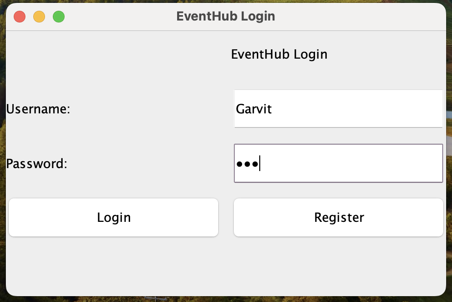
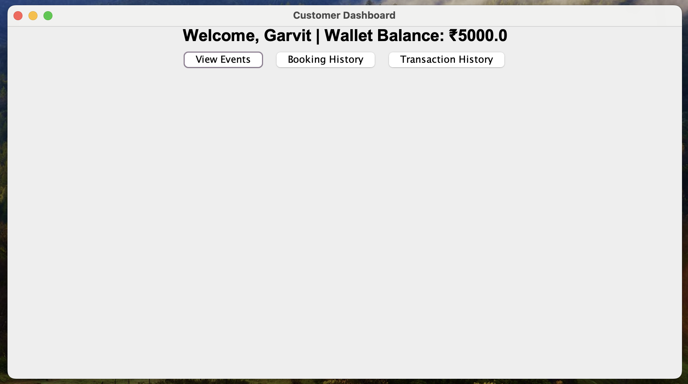
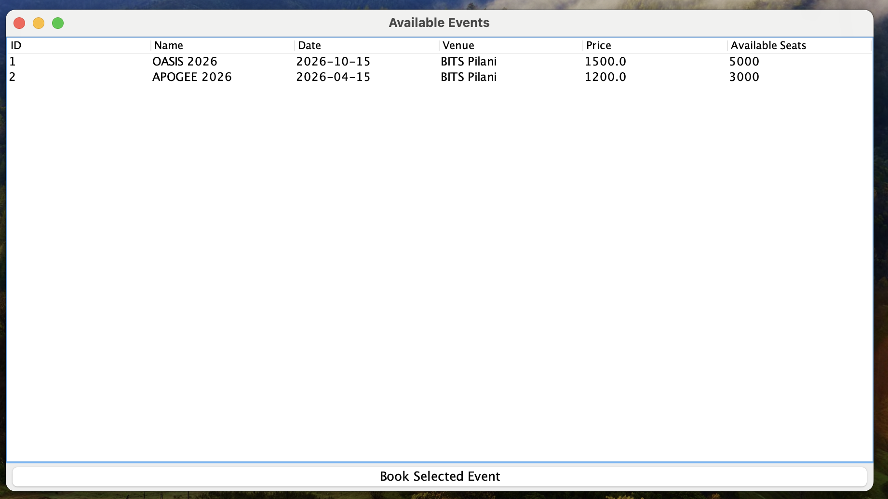
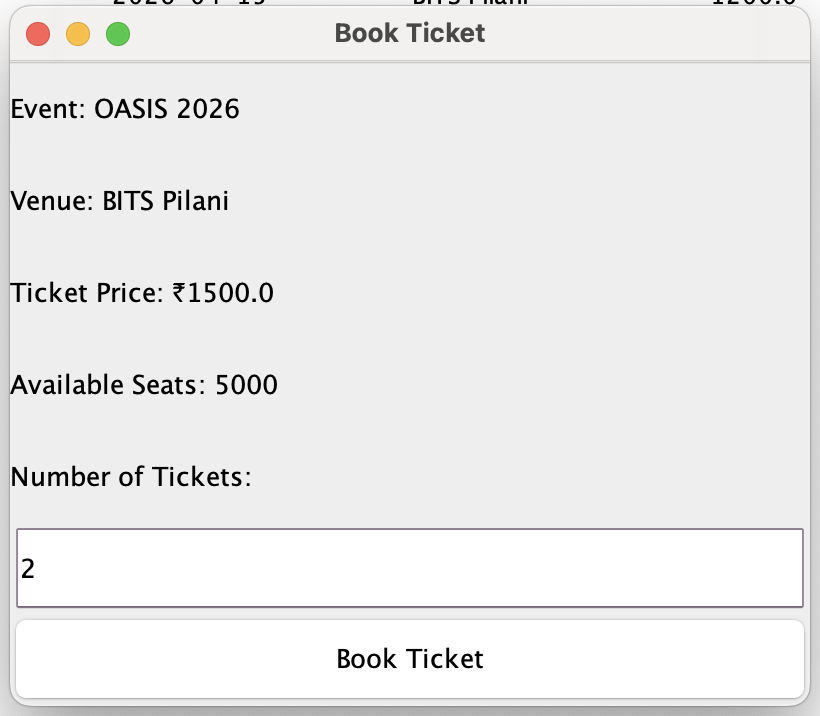
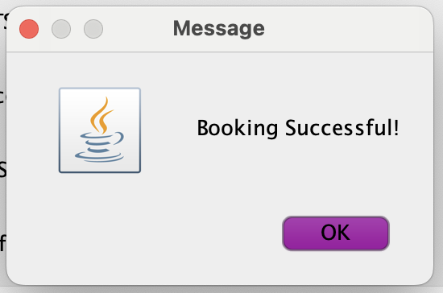
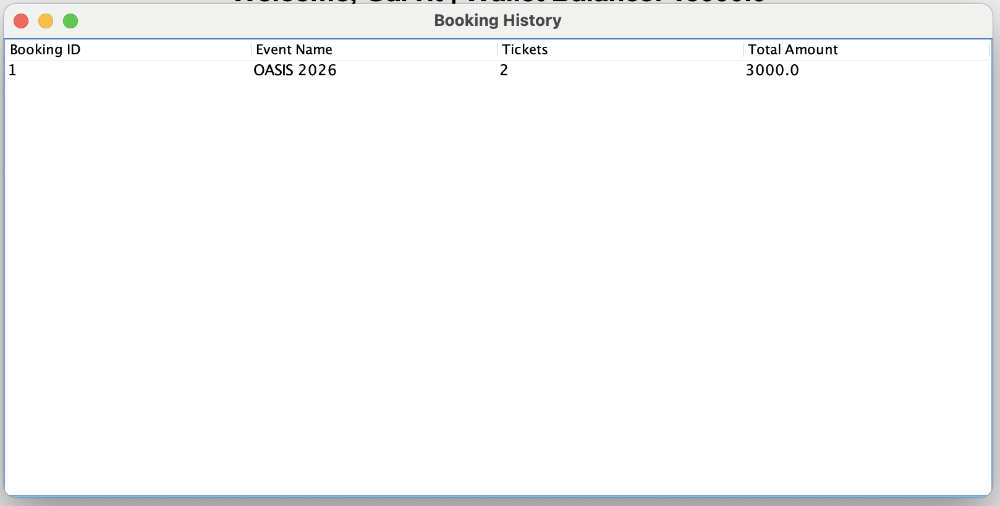
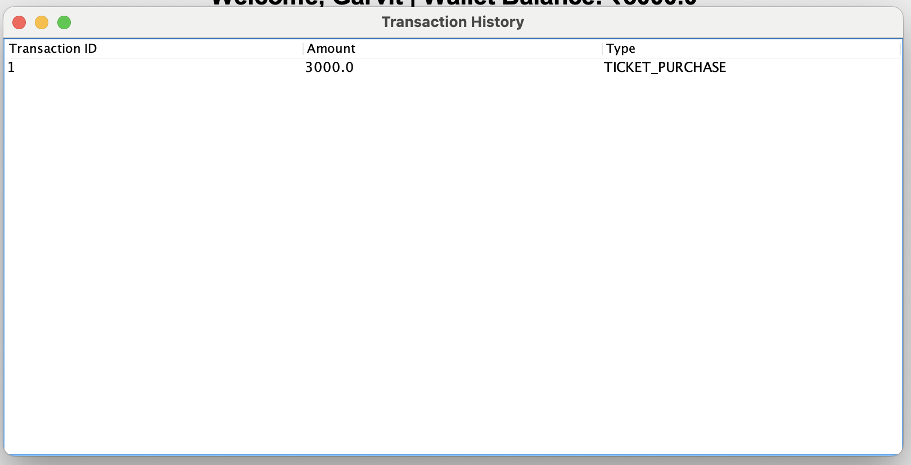
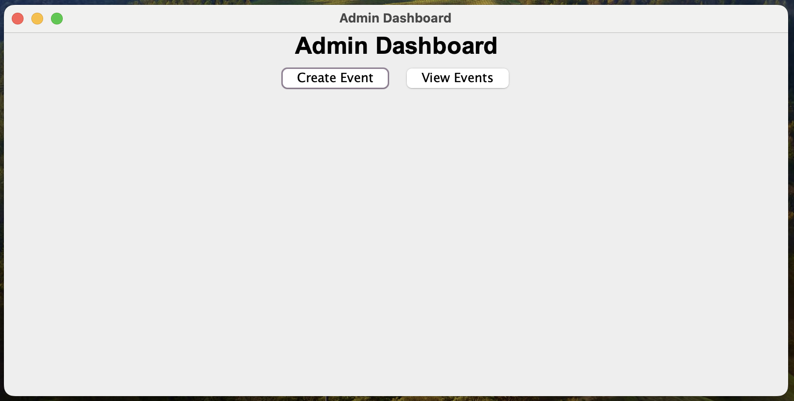
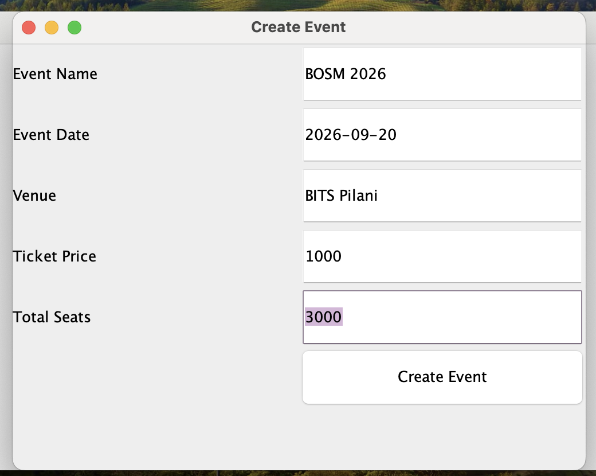

# EventHub

EventHub is a desktop-based event management system developed using Java Swing, JDBC, and MySQL. The application allows customers to browse events, book tickets, view booking history, and track transactions, while administrators can create and manage events through a separate dashboard.

The project follows a layered architecture using DAO and Service patterns and includes transaction-safe ticket booking to maintain database consistency.

---

## Features

### Customer Module

- User Login
- View Available Events
- Book Event Tickets
- View Booking History
- View Transaction History
- Wallet Balance Tracking

### Admin Module

- Admin Login
- Create New Events
- Manage Event Information

### Backend Features

- JDBC-Based Database Connectivity
- MySQL Integration
- DAO Design Pattern
- Service Layer Architecture
- Transaction Management (Commit / Rollback)
- Concurrent Booking Protection
- Row-Level Locking using `SELECT ... FOR UPDATE`

---

## Tech Stack

- Java
- Java Swing
- JDBC
- MySQL
- Git
- GitHub

---

## Project Structure

```text
src
├── dao
├── model
├── service
├── ui
├── util
└── Main.java

database
├── eventhub_schema.sql
└── sample_data.sql

screenshots
├── login.png
├── customer-dashboard.png
├── events.png
├── booking-screen.png
├── booking-success.png
├── booking-history.png
├── transaction-history.png
├── admin-dashboard.png
└── create-event.png
```

---

## Application Architecture

```text
Java Swing GUI
        ↓
Service Layer
        ↓
DAO Layer
        ↓
MySQL Database
```

---

## Screenshots

### Login Screen



### Customer Dashboard



### Available Events



### Ticket Booking



### Booking Confirmation



### Booking History



### Transaction History



### Admin Dashboard



### Create Event



---

## Database Schema

The application uses four relational tables:

### Users

Stores customer and administrator accounts.

### Events

Stores event details including ticket pricing and seat availability.

### Bookings

Stores all ticket booking records.

### Transactions

Stores payment and booking transaction history.

The complete schema is available in:

`database/eventhub_schema.sql`

---

## Concurrency Handling

During development, concurrent booking scenarios were tested to identify race conditions that could lead to overselling of tickets.

The issue was resolved using:

- Database Transactions
- Commit / Rollback Mechanisms
- Row-Level Locking (`SELECT ... FOR UPDATE`)

This ensures that only one transaction can reserve the final available seats at a time.

---

## How to Run

### 1. Clone the Repository

```bash
git clone https://github.com/garvit-budania/EventHub.git
```

### 2. Create the Database

Run:

```text
database/eventhub_schema.sql
database/sample_data.sql
```

### 3. Configure Database Credentials

Update:

```text
src/util/DBConnection.java
```

with your MySQL username and password.

### 4. Add Dependency

Add:

```text
lib/mysql-connector-j-9.7.0.jar
```

to your project libraries.

### 5. Run the Application

Execute:

```text
src/Main.java
```

---

## Sample Credentials

### Administrator

```text
Username: Naveen Singh
Password: admin123
```

### Customer

```text
Username: Garvit
Password: 123
```

---

## Future Improvements

- Event Cancellation
- Ticket Refund Workflow
- Event Search & Filtering
- Enhanced Admin Controls
- Analytics Dashboard

---

## Author

**Garvit Budania**

Developed as part of learning Java, Object-Oriented Programming, JDBC, Database Systems, Transaction Management, and Concurrent Booking Handling.
